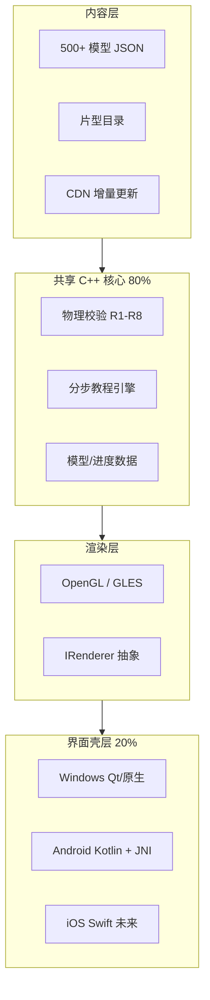

# MagTile Studio · 商业软件总规划

> 本文是产品、技术、内容、界面、平台的**唯一总纲**。子文档各司其职，本文负责串联成可商用的完整软件图景。

## 1. 产品定义

| 维度 | 定义 |
|------|------|
| **名称** | MagTile Studio（中文：磁力片工坊） |
| **定位** | 面向 4–12 岁儿童家庭的磁力片 **3D 交互搭建教程** 软件 |
| **核心价值** | 「照着搭，一定搭得起来」— 逐步物理校验 + 丰富高难度模型 |
| **差异化** | 真 3D 旋转查看 + 物理规则逐步质检 + 500+ 非批量感模型库 |
| **内容只是 1/3** | 另外 2/3 = 跨平台体验 + 订阅商业化 + 家长信任体系 |

## 2. 目标平台矩阵

| 平台 | 优先级 | 首发阶段 | 交互形态 |
|------|--------|----------|----------|
| **Windows 10/11** | P0 | M1 桌面 MVP | 鼠标轨道相机 + 键盘步进 + 全屏 |
| **Android 平板** (10"+) | P0 | M2 公测 | 触控旋转/捏合 + 横屏主布局 |
| **macOS** | P1 | M3 正式版 | 同 Windows |
| **iOS iPad** | P2 | M5 扩展 | 同 Android |
| **Linux** | 开发用 | M0 已有 | CLI + 可选 GL 窗口 |

**不做手机竖屏**：磁力片教程需要大视野 3D，最小支持宽度 1024dp。

## 3. 软件分层架构



**技术选型（MVP 推荐）**：

- **核心引擎**：C++20 `magtile_core`（已实现）— 物理、教程、JSON，全平台共享
- **桌面 UI**：**Qt 6** — 一套代码覆盖 Windows/macOS，QML 做儿童友好 UI，商业授权可接受
- **Android**：**Kotlin + NDK** 链入 `libmagtile_core.so`，UI 用 Jetpack Compose，渲染 GLES 3.0
- **备选路线**：Flutter + FFI（Android 成熟度高，桌面略弱）— 若团队前端背景强可选

## 4. 界面与体验规划

### 4.1 设计原则

- **给孩子**：大按钮、明亮但不幼稚、3D 可玩、每步有成就感动画
- **给家长**：专业可信、进度可见、付费透明、无广告、儿童隐私合规
- **商业感**：半透明磁力片材质、流畅转场、暗色/亮色主题，对标 LEGO Builder  polish

### 4.2 核心界面清单

| 界面 | 功能 | 平台差异 |
|------|------|----------|
| **启动/首页** | 继续上次、推荐模型、系列入口 | 平板横屏双栏 |
| **模型库** | 网格/列表、难度/主题/片数筛选、「我能搭」筛选 | 平板左侧筛选栏 |
| **模型详情** | 预览图、片数、难度、所需片型 BOM、开始搭建 | — |
| **教程播放器** ★ | 3D 视口 70% + 步骤面板 30% | 平板可全屏 3D |
| **步骤面板** | 中文说明、本步新增片列表、进度条、上/下一步 | 支持 TTS 朗读 |
| **自由旋转提示** | 首次引导：双指旋转、滚轮缩放 | 触控 vs 鼠标 |
| **我的收藏** | 已完成、进行中、成就徽章 | 云同步可选 |
| **片数设置** | 录入家庭拥有的磁力片数量 |  onboarding 必做 |
| **家长门** | 订阅/设置需成人验证（乘法题） | 合规必备 |
| **订阅页** | 免费 30 模型 vs 全库订阅 | 各平台 IAP |

### 4.3 教程播放器（核心屏）线框

```
┌─────────────────────────────────────────────────────────────┐
│  ← 返回          救援行动总部 · 第 8/22 步          ☆ 收藏   │
├───────────────────────────────────────┬─────────────────────┤
│                                       │  搭建车库入口围墙    │
│                                       │  ─────────────────  │
│         [ 3D 磁力片场景 ]              │  本步新增 (4片):     │
│         轨道相机 / 触控旋转             │  ■ ■ ■ △           │
│         高亮本步新片 + 描边             │                     │
│         未放置片半透明 ghost            │  💡 把三角片放在     │
│                                       │     墙角做斜撑       │
│                                       │                     │
│                                       │  ◀ 上一步  8/22  下一步 ▶ │
├───────────────────────────────────────┴─────────────────────┤
│  ████████░░░░░░░░░░░░  进度 36%                              │
└─────────────────────────────────────────────────────────────┘
```

## 5. 内容 + 软件协同里程碑

| 阶段 | 软件交付 | 内容交付 | 商业交付 |
|------|----------|----------|----------|
| **M0** ✅ | C++ 核心 + CLI + 物理校验 | 1 示例城堡 72 片 | — |
| **M1** | Windows 3D 教程播放器 + Qt UI | 20 模型（含总部/摩天楼/球道） | 内测包 |
| **M2** | Android 平板 APK + 触控 | 50 模型 | 封闭测试 |
| **M3** | 订阅/IAP + 家长门 + 进度存档 | 100 模型 | **正式商用** |
| **M4** | 云同步 + CDN 内容更新 | 250 模型 | 增长运营 |
| **M5** | iOS + UGC 编辑器 | 500+ 模型 | 生态期 |

## 6. 商业模式

| 收入来源 | 说明 |
|----------|------|
| **免费层** | 30 个精选模型，含 1 个旗舰球道体验 |
| **订阅** | 月付 ¥28 / 年付 ¥198（全库 + 每月新模型） |
| **内容包** | 单系列买断（如「滚珠乐园 20 款」¥48） |
| **B2B** | 幼儿园/培训机构站点授权 |
| **硬件联名** | 与磁力片品牌预装 APK / 扫码激活（未来） |

## 7. 质量与测试体系（软件 + 内容）

```
每层交付物
  ├─ 单元测试 (C++ core, ctest)
  ├─ 模型自动质检 (validate + 反幼稚规则 ≥40片)
  ├─ 物理负例测试 (悬空/重叠必须失败)
  ├─ 教程完整性 (逐步累计片数)
  ├─ UI 冒烟 (各平台启动 + 播放一关)
  ├─ 物理仿真抽检 (难度 4+)
  └─ 真人实物搭建 (难度 4+, 含轻敲/提起/儿童试搭)
```

**原则**：模型生成子代理完成 → **测试子代理立即接手**，不通过不合并。

## 8. 合规与品牌

- 内容命名通用化（「救援行动总部」而非商标角色名）
- 儿童隐私：中国《儿童个人信息网络保护规定》+ COPPA 原则
- 应用商店：年龄分级 4+、无第三方广告、家长门
- 著作权：模型为原创结构设计，参考公开造型但不拷贝付费 PDF

## 9. 子代理并行工作流（工程组织）

| 子代理队列 | 职责 |
|------------|------|
| **内容组** | 模型生成、内容策略、反幼稚规则 |
| **引擎组** | 物理 R5-R8、教程引擎、JSON schema |
| **渲染组** | OpenGL/GLES、材质、动画 |
| **平台组** | Windows 安装包、Android NDK、JNI |
| **UI 组** | Qt/QML 或 Compose 界面实现 |
| **测试组** | 每批交付物立即跑全量测试 |
| **商业组** | 订阅、文档、合规、运营 KPI |

全部使用 `claude-fable-5-thinking-xhigh`，**完成即测、测试通过才推送**。

## 10. 文档索引

| 文档 | 内容 |
|------|------|
| [ARCHITECTURE.md](ARCHITECTURE.md) | 模块架构 |
| [CONTENT_STRATEGY.md](CONTENT_STRATEGY.md) | 500+ 模型多样性 |
| [PHYSICS_RULES.md](PHYSICS_RULES.md) | 物理规则 |
| [ROADMAP.md](ROADMAP.md) | 内容阶段路线 |
| [COMMERCIAL_PLAN.md](COMMERCIAL_PLAN.md) | 商业策略（子代理生成中） |
| [UI_UX_SPEC.md](UI_UX_SPEC.md) | 界面规范（子代理生成中） |
| [PLATFORM_ARCHITECTURE.md](PLATFORM_ARCHITECTURE.md) | 跨平台技术（子代理生成中） |
| [TECH_ROADMAP.md](TECH_ROADMAP.md) | 工程总路线（子代理生成中） |
| [TESTING.md](TESTING.md) | 测试手册（子代理生成中） |
| [BUILD_VERIFICATION.md](BUILD_VERIFICATION.md) | 三层验证金字塔 + 儿童实测协议 |
| [COMMERCIAL_PLAN.md](COMMERCIAL_PLAN.md) | 商业化策略（定价/合规/GTM/KPI） |
| [PLATFORM_ARCHITECTURE.md](PLATFORM_ARCHITECTURE.md) | 跨平台架构（Qt 6 + NDK + SQLite） |

---

*本文随子代理交付持续更新。当前工程状态：M0 完成，M1 进行中。*
