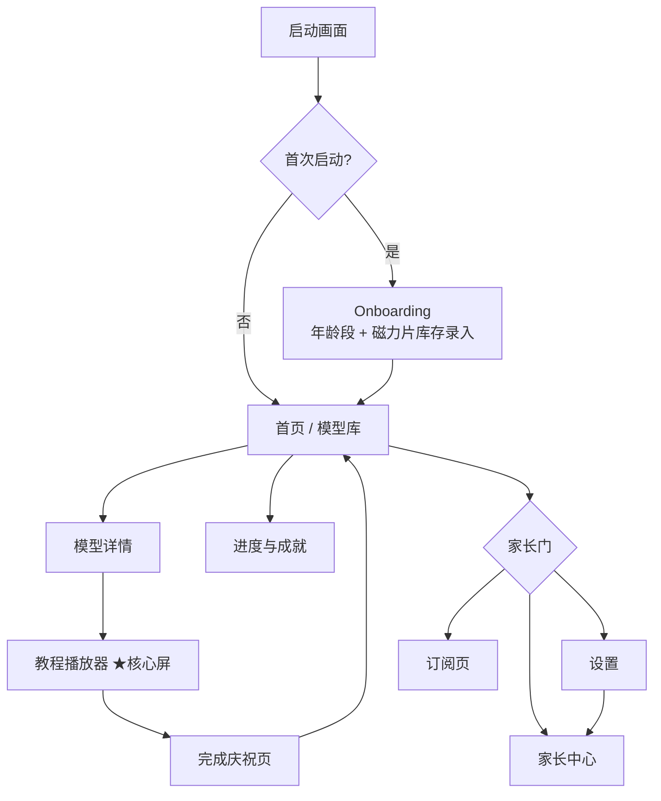
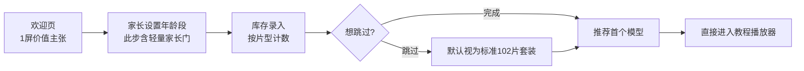
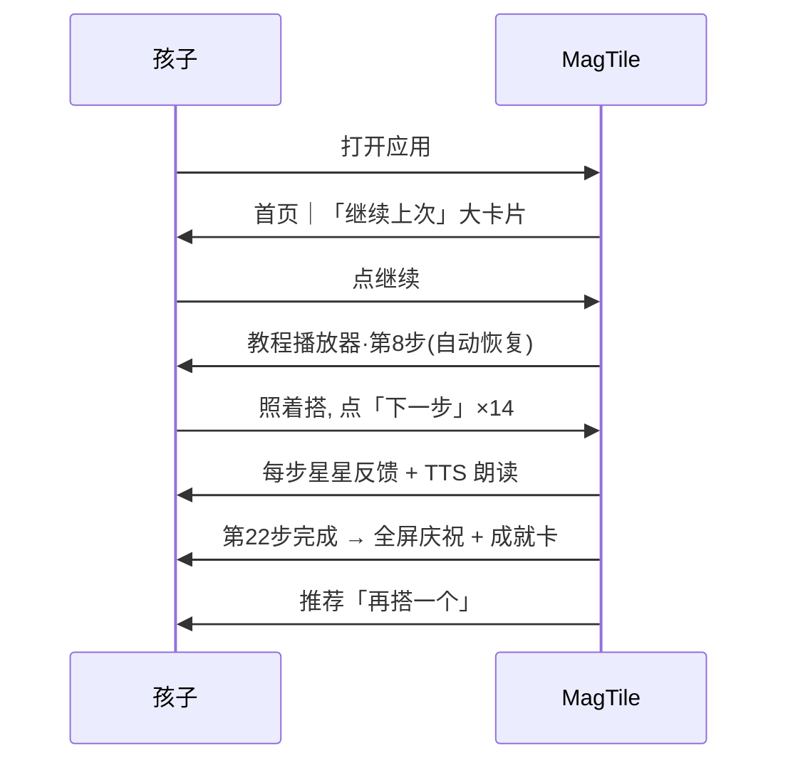
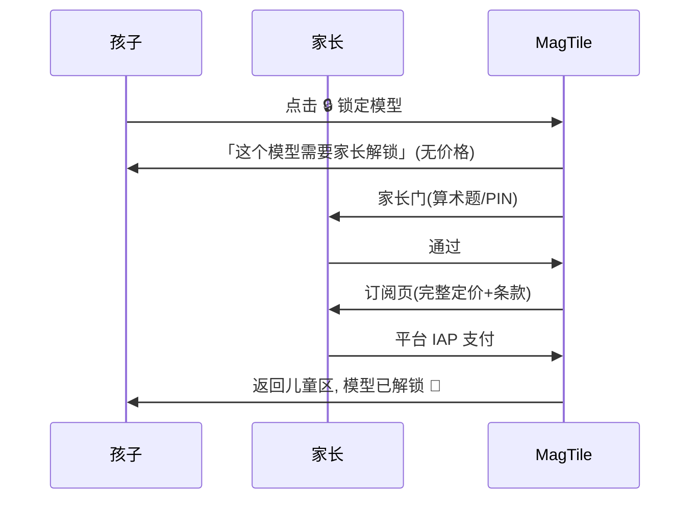

# MagTile Studio · 儿童友好商用界面规范 (UI/UX Spec)

> 本文是 MagTile Studio **全部用户界面与交互体验的唯一规范**，适用于 Windows / macOS (Qt 6 + QML)、Android 平板 (Jetpack Compose + GLES) 与未来 iPad 版本。每条规范都标注实现状态（DONE / IN_PROGRESS / PLANNED），随工程推进持续更新。
>
> 关联文档：[PRODUCT_MASTER_PLAN.md](PRODUCT_MASTER_PLAN.md)（总纲）· [SECURITY_AND_PRIVACY.md](SECURITY_AND_PRIVACY.md)（家长门与隐私的安全侧要求）· [PLATFORM_ARCHITECTURE.md](PLATFORM_ARCHITECTURE.md)（技术栈）

**状态图例**：`DONE` 已实现并有测试 ｜ `IN_PROGRESS` 已有部分实现/骨架 ｜ `PLANNED` 已规划未实现

---

## 1. 设计原则

MagTile Studio 是**商用完整产品**，不是演示 Demo。界面必须同时赢得两类人：**孩子愿意用，家长敢付费**。

### 1.1 五条铁律

| # | 原则 | 具体含义 | 反例（禁止） |
|---|------|----------|--------------|
| P1 | **儿童友好但不幼稚** | 明亮、半透明磁力片质感、圆角卡片；但排版克制、留白充分，对标 LEGO Builder / Toca Boca 的 polish | 满屏卡通贴纸、荧光撞色、抖动元素 |
| P2 | **家长可信赖** | 无广告、无外链诱导、付费透明、隐私合规可见（设置页可直达隐私声明） | 「限时优惠」倒计时、伪装成游戏内容的付费按钮 |
| P3 | **零挫败** | 任何误触都可撤销、任何界面都能一键回家、永不弹「失败」字样 | 「你答错了」「重新开始」惩罚性文案 |
| P4 | **3D 是主角** | 教程播放器 3D 视口 ≥ 70% 面积；UI 元素永远为 3D 内容让路 | 弹窗遮挡 3D 场景、常驻大面积工具栏 |
| P5 | **一致性跨平台** | 桌面与平板共用同一套设计令牌（色彩/字号/间距/圆角），仅交互输入方式不同 | 各平台各画各的界面 |

### 1.2 设计令牌（Design Tokens）— PLANNED

```
颜色（色盲安全，见 §4.7）
  primary        #2E7DD1  磁力蓝（主操作）
  success        #2C9F6B  完成绿
  warning        #E8A13C  提示琥珀（不用红色表达"错误"）
  surface        #FFFFFF / #1C2230（亮/暗主题）
  tile-*         磁力片本体色沿用实物常见 8 色，渲染层半透明材质

圆角  卡片 16dp · 按钮 24dp（胶囊）· 弹层 20dp
阴影  仅 2 级（卡片悬浮 / 弹层），拒绝重阴影
动效  标准 200ms ease-out；庆祝动画 ≤ 2.5s 且可跳过
声音  UI 音效 ≤ 0.5s、柔和打击乐；全局静音开关一步可达
```

---

## 2. 年龄分层体验（Age Bands）

Onboarding 时由**家长**选择孩子年龄段（可随时在家长区修改），全局切换 UX 模式。年龄段仅存本地设置项，**不构成儿童个人信息采集**（见 SECURITY_AND_PRIVACY.md §3）。

| 维度 | **4–6 岁「启蒙模式」** | **7–9 岁「标准模式」** | **10–12 岁「进阶模式」** |
|------|------------------------|------------------------|--------------------------|
| 模型库筛选 | 无筛选器，只有 3 个大主题入口（动物/房子/车车） | 难度 + 主题两个筛选器 | 全量筛选：难度/主题/片数/「我能搭」 |
| 卡片密度 | 每行 2 张超大卡片，图占 80% | 每行 3–4 张 | 每行 4–5 张，可切列表视图 |
| 文字量 | 步骤说明 ≤ 12 字，默认 TTS 自动朗读 | ≤ 30 字，TTS 按钮手动触发 | 完整说明 + 技巧提示，TTS 可选 |
| 步骤粒度 | 引擎按「每步 ≤ 3 片」自动细分展示 | 按模型原始步骤 | 原始步骤 + 可折叠「挑战：跳步搭建」 |
| 难度可见范围 | 只显示难度 1–2 模型 | 难度 1–4 | 全部难度 1–5 |
| 相机控制 | 自动缓慢环绕 + 单指拖动，禁用缩放（防误触） | 单指旋转 + 双指缩放 | 全自由轨道相机 + 键盘快捷键 |
| 庆祝反馈 | 每一步都有星星粒子 + 音效 | 每步轻反馈，整段完成大庆祝 | 完成庆祝 + 用时/成就统计卡 |
| 字号基准 | 22sp 起 | 18sp 起 | 16sp 起 |

**实现状态**：年龄分层框架 `IN_PROGRESS`（`core::AgeMode` 三档枚举 + SQLite 设置持久化（`progress::setAgeMode`/`getAgeMode`，未设置默认 7–9 标准模式）+ CLI 切换 `settings set-age 4|7|10` 已有，含单元测试 `age_tts`；模型库分龄卡片密度与筛选器收放已在 Qt 版与 GL 版双端落地（读同一年龄段设置自动切换：4–6 超大卡片每行 2 张、无筛选器只留超大主题入口 / 7–9 每行 3–4 张、难度+主题两个筛选器 / 10+ 紧凑卡片每行 4–5 张、全量筛选，被收起的筛选维度自动清零防"看不见的过滤"，§5.2）；步骤粒度/相机/庆祝等其余分层细则 PLANNED）；教程引擎的步骤查询接口（`visibleTiles`/`tilesAddedThisStep`）已支持任意粒度展示 `DONE`；「每步 ≤ 3 片」自动细分 `PLANNED`。

---

## 3. 界面总览与导航结构



**导航铁律**：儿童可达的任何界面，距离首页 ≤ 2 层；家长门之后的界面（设置/订阅/家长中心）不计入儿童导航深度。

| 界面 | 章节 | 实现状态 |
|------|------|----------|
| 首页 / 模型库 | §5 | `IN_PROGRESS`（GL 版模型库窗口已可运行：`magtile_app library --gui`，卡片网格/进度徽标已有；Qt 版筛选器已接入：难度/主题/「只用核心 9 片」/「我能搭的」+ 筛选空态，见 QT_UI_PLAN.md QT-1；分龄卡片密度与筛选器收放已在 Qt/GL 双端接入（4–6 超大卡片无筛选 / 7–9 难度+主题 / 10+ 全量筛选+紧凑卡片，读 SQLite 年龄段设置自动切换）；「我能搭的」空态推荐 3 个可搭模型 DONE） |
| 模型详情 | §5.4 | `IN_PROGRESS`（Qt 版详情页 DONE：难度/片数/步数、BOM 清单对照库存缺片琥珀提示、套装分层标签、收藏、「开始搭建」大按钮；可旋转 3D 预览与预计用时 PLANNED；GL 版仍从库直接进教程） |
| 教程播放器 | §6 | `IN_PROGRESS`（GL 教程窗口已可运行：步骤导航/高亮/ghost/进度条/HUD 已有；TTS 切步朗读已接入（`ITtsEngine` stub，§4.2）；动画手势提示、庆祝动画 PLANNED） |
| 进度与成就 | §7 | `IN_PROGRESS`（SQLite 存档 + CLI 查询 DONE；Qt 版进度页「我的作品」+ 成就墙 GUI DONE：三格统计/进行中/已完成/收藏列表 + 徽章墙（未解锁灰色剪影 + 达成条件），见 QT_UI_PLAN.md QT-4；成就触发定义表与 GL 版界面 PLANNED） |
| 设置 | §8 | `IN_PROGRESS`（键值存储 DONE；Qt 版家长门后设置页 DONE：字号三档/减少动效/年龄段，即时生效并与 CLI/GL 共库；主题/语言/库存复入口 PLANNED） |
| 家长门 | §9 | `IN_PROGRESS`（算术题门 stub `DONE`：中文数字乘法题 + 中文大写数字软键盘 + 冷却 + 15 分钟内存会话 + 门后家长区占位页；Qt 版门界面 + 家长中心 + 会话守卫 `DONE`（同一 `core::ParentGate`）；PIN / 手写键盘 / 家长中心完整功能 PLANNED） |
| Onboarding（库存录入） | §10 | `IN_PROGRESS`（结构化库存存取 API + CLI 录入 `inventory set` DONE；GL 版按片型计数的图形录入界面 DONE：全部片型中文名 + 大步进器/直接输入 + 保存后一键「看看我能搭什么」，首启弹窗主按钮直达录入，模型库页眉常驻「我的磁力片」入口；Qt 版首启年龄段引导 DONE（QT-5：首页上温和全屏三档大卡片，选完落盘 `age_mode` + `onboarding_age_done` 只出现一次，家长可在设置改档）；快捷套装预填 PLANNED） |
| 订阅页 | §11 | `IN_PROGRESS`（Qt 版家长门后温和占位页 DONE：「即将上线」，无倒计时/无催促/不索取信息；正式订阅页（三卡/透明条款/恢复购买）PLANNED） |

---

## 4. 儿童 UX 硬性规范（全界面通用）

以下规范适用于**所有儿童可达界面**，是验收红线，UI 评审逐条打钩。

### 4.1 触控目标 — PLANNED

- 所有可点元素**最小 48×48dp**（桌面鼠标模式最小 32×32px 且间距 ≥ 8px）；主操作按钮 ≥ 64dp 高。
- 相邻可点元素间距 ≥ 8dp，防止胖手指误触。
- **禁止**任何「小×关闭角标」类微型按钮；关闭/返回一律用左上角大号返回键或底部大按钮。
- 长按、双击、多指手势**不得**作为功能的唯一入口（4–6 岁不会用），只能作为快捷方式。

### 4.2 TTS 语音朗读 — IN_PROGRESS

> 已落地 stub：抽象接口 `tts::ITtsEngine`（`include/magtile/tts/tts_engine.hpp`，speak 内部先停旧朗读保证无叠音）+ 静音降级 `NullTts` + Linux 命令行朗读器后端（探测 espeak-ng / espeak / spd-say，子进程朗读、切步即打断）；教程切步朗读已接入 GL 教程会话与 CLI（`--tts` 显式开启；4–6 岁启蒙模式下模型库教程自动开启）；单元测试 `age_tts` 覆盖无叠音语义与探测降级。🔊 按钮 UI 与 Windows SAPI / Android / AVSpeech 原生后端 PLANNED。

- 每条步骤说明配 🔊 朗读按钮（48dp）；4–6 岁模式**进入步骤自动朗读**。
- 使用系统 TTS（Windows SAPI / Android TextToSpeech / AVSpeech），**不引入第三方语音 SDK**（隐私要求，见 SECURITY_AND_PRIVACY.md §5）。
- 文案写作规范：短句、口语化简体中文、零术语。写「把三角片靠在墙边」，不写「将等腰三角组件对齐至垂直面」。数字一律用「3 片」不用「3x」。
- TTS 朗读中切换步骤自动停止旧朗读，无叠音。

### 4.3 正向反馈 — IN_PROGRESS

- **每步完成**：新增磁力片落位动画 + 轻快音效 + 步骤面板小星星（引擎已提供 `tilesAddedThisStep` 数据 `DONE`；动画表现 `PLANNED`）。
- **整个模型完成**：全屏庆祝（彩带粒子 + 完成徽章 + 「搭好啦！」），停留 ≤ 2.5s 可点击跳过，随后展示成就卡（用时/片数/解锁成就）。
- 反馈只有「正向」与「中性」两档：做对了→庆祝；没做对→无声等待或温和提示，**永远不出现失败音效、红叉、震动惩罚**。

### 4.4 容错与撤销 — IN_PROGRESS

- 「上一步」永远可用且免费（教程引擎 `previousStep()` `DONE`），步骤跳转 `goToStep()` `DONE`。
- 误触任何按钮都可在 1 步内返回原界面；**破坏性操作**（重置进度）只存在于家长区。
- 教程中途退出自动存档到当前步（进度存储 `DONE`，GUI 退出即存 `DONE`），再次进入从原步骤继续，绝不清零。
- 界面上不存在「确定要放弃吗？」式追问弹窗——退出即保存，回来即继续。

### 4.5 无暗黑模式（No Dark Patterns）— 设计红线，持续生效

- **无任何形式广告**（含自家交叉推广弹窗）。
- **无倒计时、无限时促销、无稀缺话术**出现在儿童可达界面。
- 付费入口在儿童界面**只有一种形态**：锁定模型卡片上的 🔒 角标；点击后进入家长门，儿童侧永远看不到价格与支付按钮。
- **所有外链**（隐私政策、客服、评分引导）一律位于家长门之后。
- 不做每日签到/连续登录奖励等成瘾机制；成就只与**搭建行为**挂钩。
- 免费/付费内容视觉平权：锁定内容不用「灰暗+哭脸」贬低表达。

### 4.6 分龄简化（4–6 岁细则）— PLANNED

- 首页仅 3 个超大主题入口 + 「继续上次」大卡片，无搜索、无筛选、无列表。
- 全部导航图标配文字（认字过渡期），图标语义具象（小房子=回家）。
- 禁用缩放手势与双击；相机自动缓慢环绕，单指拖动即可看另一面。
- 步骤自动朗读 + 高亮新片呼吸闪烁，看不懂文字也能照搭。

### 4.7 无障碍：色盲安全与阅读友好 — PLANNED

- **色盲安全**：状态信息**永不单靠颜色**表达——完成 = 绿色✓ + 徽章图形；本步新片 = 高亮 + 描边 + 呼吸动画。主色板避开红绿对比对（用蓝/琥珀/绿✓图形三重编码），并以 Deuteranopia / Protanopia 模拟器逐屏验收。
- **阅读友好（Dyslexia-friendly）**：正文字号可在设置中三档缩放（100% / 125% / 150%）；行高 ≥ 1.5；不使用斜体长文本；中文字体选笔画开放的黑体（思源黑体/系统黑体），拒绝艺术字正文。
- 对比度：正文对背景 ≥ 4.5:1，大字号 ≥ 3:1（WCAG AA）。
- 全部动效尊重系统「减少动态效果」设置：庆祝粒子降级为静态徽章淡入。

---

## 5. 首页 / 模型库

### 5.1 布局（7–9 岁标准模式，平板横屏）

```
┌────────────────────────────────────────────────────────────────┐
│  MagTile 磁力片工坊        [我的进度 🏅]        [家长区 🔒(小,右上)] │
├──────────────┬─────────────────────────────────────────────────┤
│  筛选         │   ▶ 继续上次: 救援行动总部 · 第8/22步  [大卡片]     │
│  ◉ 全部       │  ───────────────────────────────────────────    │
│  ○ 难度 ★~★★★│   ┌────────┐ ┌────────┐ ┌────────┐ ┌────────┐   │
│  ○ 主题 🏰🚒🐘 │   │城堡地基 │ │彩虹桥   │ │摩天楼   │ │球道塔🔒│   │
│  ○ 片数 ≤my  │   │ ★ 72片 │ │ ★★ 96片│ │★★★ 120│ │★★★★   │   │
│  ☑ 我能搭     │   │ ✓已完成 │ │ ▶第3步 │ │        │ │ (订阅) │   │
│              │   └────────┘ └────────┘ └────────┘ └────────┘   │
└──────────────┴─────────────────────────────────────────────────┘
```

### 5.2 规范条目

| 条目 | 规范 | 状态 |
|------|------|------|
| 继续上次 | 首页最顶部大卡片，一键回到断点步骤 | `IN_PROGRESS`（进度数据 DONE，GUI 大卡片 PLANNED；GL 库窗口已显示进行中徽标） |
| 模型卡片 | 预览渲染图 + 名称 + 难度星 + 片数 + 状态徽标（✓完成 / ▶进行中 / 🔒订阅） | `IN_PROGRESS`（GL 版卡片网格已有；预览图管线 PLANNED） |
| 「我能搭」筛选 | 依据库存（§10）过滤片数与片型 BOM 满足的模型 | `IN_PROGRESS`（GL 模型库「我能搭的」勾选框 DONE：依 `canBuild` BOM 对照过滤，未登记库存时禁用并就地给「去登记」图形录入入口；库存保存后即刻重算并可一键跳回已开筛选的模型库；Qt 版侧栏「我能搭的」+「只用核心 9 片」筛选 DONE：同 `canBuild` BOM 对照 + 卡片「还缺 N 片」琥珀徽标，未登记库存时禁用并温和引导；步骤级缺片提示 PLANNED） |
| 筛选器分龄 | 4–6 无筛选 / 7–9 两项 / 10–12 全量（§2） | `DONE`（Qt 版与 GL 版均按年龄段收放并同步切卡片密度：4–6 隐藏搜索/筛选、只留超大主题入口、超大卡片约每行 2 张 / 7–9 难度+主题两个筛选器、每行 3–4 张 / 10+ 全量筛选（难度/主题/收藏/核心 9 片/我能搭的）、紧凑卡片每行 4–5 张；被收起的筛选维度自动清零，防止"看不见的筛选"悄悄过滤列表；读 SQLite 年龄段设置自动切换，家长区改档即时生效） |
| 空态 | 筛选无结果时给「换个条件试试」+ 推荐 3 个可搭模型，不出现空白页 | `DONE`（Qt 版:「换个条件试试」+ 一键「看全部模型」+ 开着「我能搭的」时无视其他筛选推荐 3 个现在就能搭的模型（canBuild 按难度升序、同难度片数少者优先，点击直达详情，`LibraryFilterModel::recommendBuildable` 有单测）；GL 版空态同口径推荐 3 张可搭卡片） |
| 加载性能 | 首页冷启动 → 可交互 ≤ 2s（中端平板）；卡片图懒加载 | `PLANNED` |

### 5.3 「我的进度」入口

首页右上（儿童可达，48dp），进入 §7 进度与成就页。**家长区入口**刻意做小（32dp，但周围留白达标）且带 🔒 图标——它是全应用唯一允许低于 48dp 的可点元素，防儿童误入 + 家长门兜底（见 §9）。

### 5.4 模型详情页 — IN_PROGRESS

进入教程前的确认页：大预览图（可拖动旋转的 3D 预览）、难度、片数、**所需片型 BOM 清单**（对照家庭库存，缺片显示「缺 4 片正方形」琥珀提示 + 替代建议）、预计用时、「开始搭建」大按钮（64dp 高、占宽 80%）。

**实现状态**：Qt 版详情页 DONE（难度星/片数/步数、BOM 清单逐片型对照库存（「✓ 够用」/「缺 N 片」琥珀提示 + 替代建议文案）、「核心 9 片就能搭 / 会用到扩展片」套装分层标签、收藏切换、进行中/已完成进度回显、「开始搭建/继续搭建」大按钮（高 64、占宽 80%），见 QT_UI_PLAN.md QT-1）；可拖动旋转的 3D 预览与预计用时 PLANNED（QT-3 视口就绪后接入）；GL 版无详情页。

---

## 6. 教程播放器（核心屏 ★）

### 6.1 布局

```
┌─────────────────────────────────────────────────────────────┐
│  ← 返回      救援行动总部 · 第 8/22 步          ☆收藏  🔊朗读 │
├───────────────────────────────────────┬─────────────────────┤
│                                       │  搭建车库入口围墙    │
│      [ 3D 磁力片场景 ≥70% 宽 ]         │  ──────────────    │
│      · 已放置片：实体材质               │  本步新增 (4片):    │
│      · 本步新片：高亮+描边+呼吸          │  ■ ■ ■ △          │
│      · 未来片：半透明 ghost 预览        │                    │
│      · 首次进入：👋动画手势提示旋转      │  💡 三角片放墙角    │
│                                       │     做斜撑更稳      │
│                                       │                    │
│                                       │ ◀上一步  8/22 下一步▶│
├───────────────────────────────────────┴─────────────────────┤
│  ████████░░░░░░░░░░  36%   ⭐每完成10%点亮一颗小星            │
└─────────────────────────────────────────────────────────────┘
```

### 6.2 规范条目

| 条目 | 规范 | 状态 |
|------|------|------|
| 步骤导航 | 上一步/下一步大按钮（≥64dp）、进度分数、任意跳步 | `DONE`（引擎 + GL HUD 均已实现） |
| 本步新片高亮 | 新增片描边 + 呼吸动画，参照片二级高亮 | `IN_PROGRESS`（引擎数据 DONE；GL 高亮已有，呼吸动画 PLANNED） |
| **Ghost 预览** | 后续未放置片以 15% 透明度 ghost 显示，可在面板开关；4–6 岁默认只 ghost 下一步，防视觉过载 | `IN_PROGRESS`（引擎可枚举未来片 DONE；GL ghost 渲染已有；分龄开关 PLANNED） |
| **旋转提示** | 首次进入播放器：半透明👋手势动画（触屏：单指划弧；桌面：鼠标图标+拖动轨迹），3s 后淡出，完成一次旋转即永久消失（记入 settings） | `PLANNED` |
| 轨道相机 | 拖动旋转 / 滚轮·双指缩放 / 平移，带阻尼 | `DONE`（orbit_camera + GL 窗口交互） |
| TTS 朗读 | §4.2；朗读时🔊按钮变波形动画 | `IN_PROGRESS`（`ITtsEngine` + Linux espeak/spd-say 后端 + 切步自动朗读/自动打断已有，`--tts` 或 4–6 岁模式开启；🔊 按钮与波形动画 PLANNED） |
| 步骤庆祝 | §4.3 分层反馈；进度条每 10% 点亮一颗小星 | `PLANNED` |
| 完成庆祝页 | 全屏彩带 + 徽章 + 成就卡 + 「再搭一个」推荐 2 个相近难度模型 | `PLANNED`（完成写库 DONE） |
| 断点续搭 | 退出自动存档；重进恢复步骤与相机 | `IN_PROGRESS`（步骤存档 DONE；相机姿态恢复 PLANNED） |
| 收藏 | ☆ 一键收藏 | `IN_PROGRESS`（存储 API DONE；GUI 按钮 PLANNED） |
| 防误触退出 | 「返回」直接退（已自动存档），不弹确认框（§4.4） | `DONE`（GL 版返回即存档退出） |

### 6.3 步骤面板文案规范

- 标题 ≤ 10 字动词开头（「搭建围墙」）；正文分龄长度限制见 §2。
- 「本步新增」用片型色块图例 + 数量，不依赖文字。
- 💡提示行只放**搭建技巧**，不放催促/评价性语言。

---

## 7. 进度与成就

### 7.1 布局 — Qt 版 GUI DONE（数据层 DONE；GL 版 GUI PLANNED）

```
┌────────────────────────────────────────────────┐
│  ← 返回                我的作品                  │
├────────────────────────────────────────────────┤
│  🏅 成就墙:  [首搭达成✓] [十片小匠✓] [百步不倦…]  │
├────────────────────────────────────────────────┤
│  进行中 (2)                                     │
│   ▶ 救援行动总部  ████░░ 8/22 步   [继续搭建]     │
│  已完成 (3)                                     │
│   ✓ 城堡地基 · 8月20日 · 用时23分  [再搭一次]     │
└────────────────────────────────────────────────┘
```

| 条目 | 规范 | 状态 |
|------|------|------|
| 进行中/已完成列表 | 按最近游玩/完成时间排序 | `DONE`（`listInProgress`/`listCompleted` + CLI；Qt 版进度页列表: 进度条/完成日期/用时, 行点击直达详情） |
| 成就系统 | 解锁幂等、保留首次时刻；成就只与搭建行为挂钩（§4.5） | `DONE`（存储）；成就定义表与解锁触发 `IN_PROGRESS`；徽章 UI `PLANNED` |
| 用时统计 | 累计游玩秒数只增不减 | `DONE` |
| 未解锁成就展示 | 显示灰色剪影 + 达成条件（可读懂的一句话），不显示进度百分比（防焦虑） | `DONE`（Qt 版成就墙：低透明度剪影 + 条件一句话；徽章按完成模型数 1/3/10/30 分档，只与搭建行为挂钩 §4.5） |
| 重置进度 | **仅家长区可操作**（§9），二次确认 | `IN_PROGRESS`（`resetProgress` API + CLI DONE；入口收进家长区 PLANNED） |

---

## 8. 设置

设置分两层：**儿童可达的最小设置**（音量/朗读开关，图标化大开关）与**家长门后的完整设置**。

| 设置项 | 位置 | 状态 |
|--------|------|------|
| 音效/音乐音量、TTS 开关 | 儿童侧（播放器内浮层） | `PLANNED`（键值存储 DONE） |
| 年龄段模式切换 | 家长区 | `IN_PROGRESS`（`AgeMode` 存储 + CLI `settings set-age`/`show` DONE；Qt 版家长区设置页三档选择 DONE，与 CLI/GL 共用同一设置键；Qt 版首启 Onboarding 前置引导 DONE（三档大卡片、`onboarding_age_done` 标记只出现一次，见 QT_UI_PLAN.md QT-5）；GL 版前置流程 PLANNED） |
| 字号缩放三档、减少动效 | 家长区（跟随系统 + 手动覆盖） | `IN_PROGRESS`（Qt 版设置页手动三档 100/125/150% + 减少动效开关 DONE，全应用即时生效并存 SQLite（`progress/ui_settings`）；跟随系统 PLANNED） |
| 主题（亮/暗/跟随系统） | 家长区 | `PLANNED` |
| 语言（简中首发；繁中/英文 M4+） | 家长区 | `PLANNED` |
| 磁力片库存管理（§10 复入口） | 家长区 | `PLANNED` |
| 隐私政策/儿童个人信息保护声明入口 | 家长区（外链需家长门，本文档内置离线副本优先） | `PLANNED` |
| 数据导出/清除（合规要求） | 家长区 | `PLANNED`（见 SECURITY_AND_PRIVACY.md §4） |

---

## 9. 家长门（Parent Gate）

**定位**：儿童区与家长区之间的强制关卡。所有 **付费、设置、外链、账号、数据操作** 必须先过门（安全侧完整要求见 [SECURITY_AND_PRIVACY.md](SECURITY_AND_PRIVACY.md) §6）。状态：`IN_PROGRESS`（算术题门 GL 版 stub + Qt 版门界面/家长中心/门后设置页 `DONE`，见 §9.0；PIN 与家长中心完整功能 PLANNED）。

### 9.0 已实现：家长门 stub — DONE

商用儿童安全模式已在桌面模型库（`library --gui`）落地并有测试：

- **可复用逻辑模块** `core::ParentGate`（`include/magtile/core/parent_gate.hpp`）：乘法题随机生成（贰~玖 两个个位数相乘，题面中文数字如「叁 × 柒 = ?」）、中文大写数字答案验证（`贰拾壹`；接受 `壹拾贰`/`拾贰` 变体）、3 次答错 → 60 秒冷却状态机、**15 分钟家长会话（只存内存，不落盘，重启即失效）**。纯逻辑层不依赖 UI/平台，单元测试 `parent_gate`（`tests/test_parent_gate.cpp`）覆盖题目生成域 / 验证逻辑 / 冷却状态机 / 会话有效期。
- **模型库入口**：页眉右上「家长区」按钮（刻意 32dp 小尺寸，§5.3）；无有效会话时先进家长门，15 分钟会话内免重复验证。
- **门界面**：「请家长来完成」+ 算术题 + 中文大写数字软键盘（不依赖物理键盘/输入法，平板同款交互）+ 温和的答错/冷却提示（「再试一次吧」「休息一下」，P3 零挫败）；门界面无任何商品/价格信息。
- **门后家长区占位页**：订阅管理（占位，即将上线）/ 设置（占位）/ 隐私与数据说明 + 会话剩余时间 +「锁定家长区」（立即结束会话）。
- **冒烟测试**：`library --gui --parent-gate` 深链直开门界面，`library_gui_smoke` 无头渲染并截图校验。

**Qt 版（QT-2）已复刻同一交互并接入同一 `core::ParentGate`**：首页 32dp 家长区入口 → 家长门（乘法题 + 中文大写数字软键盘 + 冷却「休息一下」，15 分钟会话内免重复验证）→ 家长中心（会话剩余倒计时 / 订阅占位入口 / 设置入口 / 隐私说明 /「锁定家长区」）。设置页（字号三档 / 减少动效 / 年龄段，即时生效并落 SQLite）与订阅温和占位页（「即将上线」，无倒计时无催促）均在门后；会话到期或锁定时由统一守卫自动退回首页。测试：后端桥单测 `qt_backend_bridges`（含与 CLI/GL 的共库契约）、无头 QML 冒烟 `qt_gui_smoke`（`--parent-gate` 深链 + `--smoke-parent-flow` 自动驾驶走完 门→家长中心→设置→订阅）。

仍为 PLANNED：可选 4 位 PIN（哈希存储）、手写数字键盘、家长中心完整功能（§9.2）、正式订阅页（§11）。

### 9.1 交互规范

```
┌──────────────────────────────┐
│         请家长来完成          │
│                              │
│   请用中文大写输入答案:        │
│      37 + 26 = ?             │
│   ┌────────────────────┐     │
│   │  （手写数字键盘）     │     │
│   └────────────────────┘     │
│         [ 确认 ]  [ 返回 ]    │
└──────────────────────────────┘
```

- **默认门**：两位数加/乘法随机题（答案要求以**中文大写数字**输入，如「陆拾叁」，进一步拉开与学龄儿童的差距）。
- **可选升级**：家长在首次过门后可设置 4 位 PIN 取代算术题；PIN 以加盐哈希存本地（见安全文档 §6.2）。
- 连续答错 3 次 → 冷却 60 秒（界面显示温和的「休息一下」，无惩罚音效）。
- 门界面**不出现**任何商品/价格信息——先过门，再见到订阅页。
- 平台合规：满足 Apple「儿童类」与 Google Play 家庭政策对 parental gate 的要求。

### 9.2 家长中心（门后首页）— PLANNED

聚合：订阅管理 / 孩子年龄段与模式 / 库存管理 / 进度重置 / 隐私与数据 / 关于与客服。设计风格切换为「成人信息密度」：允许小字号、数据表格。

---

## 10. Onboarding 与磁力片库存录入

**目标**：首启 ≤ 90 秒完成「家长设年龄 → 录库存 → 孩子开搭」。库存录入是「我能搭」筛选与 BOM 缺片提示的数据源。

### 10.1 流程 — IN_PROGRESS（库存存取 API + CLI 录入 + GL 版图形录入界面 + Qt 版首启年龄段引导 DONE；GL 版年龄段前置步骤与快捷套装预填 PLANNED）

现阶段的首启行为：模型库 GUI 启动时若从未登记库存（`hasInventory()` 为假）且未看过提示，弹出「先登记家里的磁力片」弹窗（压暗遮罩 + 价值说明），主按钮「现在登记」直达按片型计数的图形录入界面（§10.2）；「稍后再说」落盘 `inventory_onboarding_done` 标记后不再打扰——跳过永远可见，录库存不是付费墙。录入界面保存即写入与 CLI 共用的 `tile_inventory` 表（含 0 数量的「明确没有」），并可一键「保存，看看我能搭什么」跳回已开启「我能搭的」筛选的模型库；模型库页眉常驻「我的磁力片」入口供随时修改（冒烟：`tests/test_inventory_gui.sh` 校验图形路径写入后 CLI `inventory show/match` 能读到）。Qt 版首启（存档从未写过 `age_mode` 键且无 `onboarding_age_done` 完成标记）在首页之上先弹温和全屏**年龄段引导**：三档大卡片（4-6/7-9/10+，儿童友好文案，无跳过焦虑——默认档就在卡里），选完即落盘并进入首页，只出现一次，家长随时可在设置页改档（实现与冒烟见 QT_UI_PLAN.md QT-5 补充说明）。



### 10.2 库存录入界面规范

```
┌────────────────────────────────────────────┐
│   家里有哪些磁力片?  (照着盒子数一数)          │
│  ┌──────┐  ┌──────┐  ┌──────┐  ┌──────┐   │
│  │ ■正方 │  │ △三角 │  │ ▭长方 │  │ ⬠五边 │   │
│  │ - 30 +│  │ - 20 +│  │ - 8 + │  │ - 2 + │   │
│  └──────┘  └──────┘  └──────┘  └──────┘   │
│   快捷: [标准102片套装] [豪华198片] [自定义]   │
│              [先跳过, 以后再填]               │
└────────────────────────────────────────────┘
```

- 计数用 **大号 − / + 步进器**（各 48dp），支持长按连加；不用键盘输入（家长孩子可协作完成）。
- 提供常见套装一键预填；「跳过」永远可见——录库存不是付费墙。
- 片型图例与 3D 渲染同源建模，认得出实物。
- 库存按片型存入本地 SQLite `tile_inventory` 表（`setInventory`/`getInventory` `DONE`）；片型标识与数量在存储层强校验（安全文档 §7），v1 时代的库存 JSON 打开存档时自动迁移。

---

## 11. 订阅页（家长门之后）

**原则**：给家长看的页面 = 信息完整、无套路（定价策略见 [COMMERCIAL_PLAN.md](COMMERCIAL_PLAN.md) §2/§3）。状态：`IN_PROGRESS`（Qt 版家长门后温和占位页 DONE：「即将上线」+ 免费可玩说明，无倒计时/无催促/不索取信息；下表正式订阅页 PLANNED）。

| 条目 | 规范 |
|------|------|
| 布局 | 三卡横排：月度 ¥28 / **年度 ¥198（主推，徽标「最划算」）** / 家庭年度 ¥268；下方内容包货架 |
| 透明条款 | 卡片内直接写明：自动续费规则、取消路径（「App Store › 订阅」一步说明）、7 天无理由退款（年度） |
| 免费额度说明 | 页首明示「无需付费也可玩 30 个精选模型」——反套路即信任 |
| 恢复购买 | 显眼的「恢复购买」按钮（App Store 审核硬要求） |
| 支付 | 全部走平台 IAP（Apple/Google/微软商店）；桌面直销版走正规支付网关，见安全文档 §8 |
| 禁止事项 | 无倒计时、无「即将涨价」、无预勾选加购、订阅前不索取任何个人信息 |
| 订阅状态离线宽限 | 本地凭证宽限 7 天，短期断网不锁内容（COMMERCIAL_PLAN §5） |

---

## 12. 关键流程线框（补充）

### 12.1 儿童主循环（Happy Path）



### 12.2 付费流程（家长参与）



---

## 13. 平台交互差异表

| 交互 | Windows/macOS | Android/iPad 平板 |
|------|---------------|--------------------|
| 旋转 | 鼠标左键拖动 | 单指拖动 |
| 缩放 | 滚轮 | 双指捏合（4–6 岁模式禁用） |
| 步进 | ←/→ 方向键 + 屏幕按钮 | 屏幕按钮 + 左右滑步骤面板 |
| 全屏 3D | F11 / 双击视口 | 收起面板按钮 |
| 家长门键盘 | 物理键盘 | 应用内大数字键盘 |
| 最小窗口 | 1024×640 逻辑分辨率 | 横屏锁定，最小宽 1024dp |

状态：桌面 GL 窗口交互 `DONE`；平板触控 `PLANNED`（Android 壳 `IN_PROGRESS`）。

---

## 14. 验收清单（UI 评审逐条打钩）

**每个新界面合入前必须通过：**

- [ ] 全部可点元素 ≥ 48dp（儿童侧），间距 ≥ 8dp
- [ ] 无红叉/失败文案/惩罚音效；破坏性操作不在儿童侧
- [ ] 色盲模拟器（Deuteranopia/Protanopia）下信息不丢失
- [ ] 对比度 AA 达标；字号三档缩放不破版
- [ ] 无广告、无倒计时、无儿童侧价格显示、外链均在家长门后
- [ ] TTS 覆盖全部步骤文案；朗读无叠音
- [ ] 任意界面 ≤ 2 步回首页；退出教程自动存档
- [ ] 冷启动 ≤ 2s、教程切步 ≤ 100ms、渲染 ≥ 30fps（中端平板）
- [ ] 4–6 岁模式下走查：无缩放手势依赖、无长文本、无小按钮

---

## 15. 实现状态汇总

| 领域 | DONE | IN_PROGRESS | PLANNED |
|------|------|-------------|---------|
| 核心引擎 | 教程步进/高亮/ghost 数据、物理校验、进度与成就存储、库存存取、轨道相机、`AgeMode` 枚举 + 年龄段设置存取 | — | 每步≤3片自动细分 |
| 教程播放器 | GL 窗口步骤导航、高亮/ghost 渲染、退出存档 | 呼吸动画、相机姿态恢复、收藏按钮、TTS 切步朗读（`ITtsEngine` stub + Linux espeak/spd-say 后端 + `--tts`/启蒙模式自动开启；🔊 按钮与原生后端待做） | 手势提示、庆祝动画、完成页 |
| 模型库 | Qt 版筛选器（难度/主题/「只用核心 9 片」/「我能搭的」+ 筛选空态）、Qt 版模型详情页（BOM 对照库存缺片琥珀提示 + 收藏 + 开始搭建）、分龄卡片密度与筛选器收放（Qt/GL 双端三档，读年龄段设置自动切换）、「我能搭的」空态推荐 3 个可搭模型（难度升序，Qt/GL 双端） | GL 卡片网格 + 进度徽标、「我能搭的」库存筛选 | 详情页 3D 预览、步骤级缺片提示 |
| 进度成就 | 数据层 + CLI、Qt 版进度页「我的作品」+ 成就墙 GUI（未解锁灰色剪影 + 达成条件） | 成就定义与触发（展示层按完成数分档已判定, 写库触发待统一收口） | GL 版成就墙 |
| 家长门/订阅 | 算术题门 stub（`core::ParentGate` + 软键盘门界面 + 15 分钟内存会话 + 家长区占位页 + 单元/冒烟测试）、Qt 版家长门 + 家长中心 + 门后设置页/订阅占位页 + 会话守卫（`qt_backend_bridges`/`qt_gui_smoke`） | 家长区入口已接入模型库 | PIN、手写键盘、家长中心完整功能、正式订阅页（M3 商用前置） |
| Onboarding | 结构化库存 API + CLI 录入（`inventory set/show/match`）、首启空库存提示弹窗 stub、Qt 版首启年龄段三档大卡片引导（只出现一次 + 设置页可改档） | 年龄段选择（存储 + CLI + Qt 版首启引导已有，GL 版前置流程待做） | 按片型计数的图形录入界面 |
| 无障碍/分龄 | 字号三档缩放 + 减少动效（Qt 版设置页即时生效，`progress/ui_settings` 存储） | 年龄分层框架（AgeMode 三档 + 启蒙模式布局 + Qt 版家长区年龄段切换 + TTS 自动朗读，单元测试 `age_tts`） | 其余分龄细则、色盲安全、跟随系统 |

> 状态变更须同步更新本表与 [PRODUCT_MASTER_PLAN.md](PRODUCT_MASTER_PLAN.md)「商用功能清单」。
